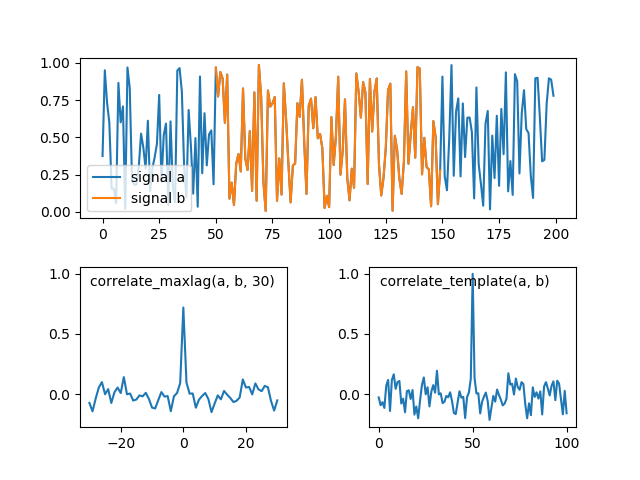

## Normalized cross-correlation or cross-correlation with specified maximum lag

The following code creates two random signals and plots correlation with specified maximal lag and normalized cross-correlation.

```py
    import matplotlib.pyplot as plt
    import numpy as np
    from xcorr import correlate_maxlag, correlate_template, get_lags

    np.random.seed(42)
    N = 200
    maxlag = 30
    a = np.random.random(N)
    start = N // 4
    b = a[start:-start]
    cc1 = correlate_maxlag(a, b, maxlag)
    cc2 = correlate_template(a, b)

    grid = plt.GridSpec(2, 2, wspace=0.4, hspace=0.3)
    ax1 = plt.subplot(grid[0, 0:])
    ax2 = plt.subplot(grid[1, 0])
    ax3 = plt.subplot(grid[1, 1], sharey=ax2)
    ax1.plot(np.arange(len(a)), a, label='signal a')
    ax1.plot(np.arange(len(b)) + start, b, label='signal b')
    ax2.plot(get_lags(cc1), cc1)
    ax3.plot(cc2)
    ax1.legend(loc=3)
    kw = dict(xy=(0.05, 0.95), xycoords='axes fraction', va='top')
    ax2.annotate('correlate_maxlag(a, b, {})'.format(maxlag), **kw)
    ax3.annotate('correlate_template(a, b)', **kw)
    plt.savefig('xcorr_example.png')
    plt.show()
```

